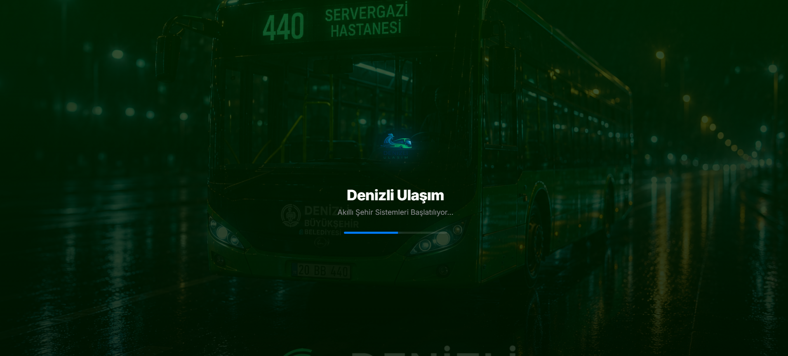
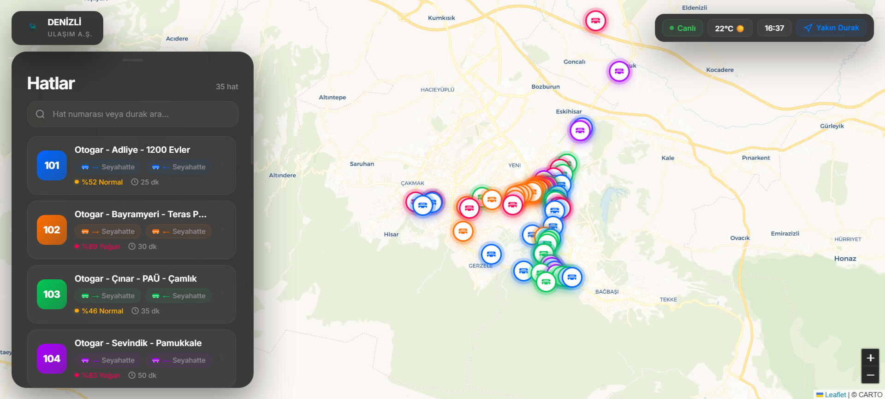
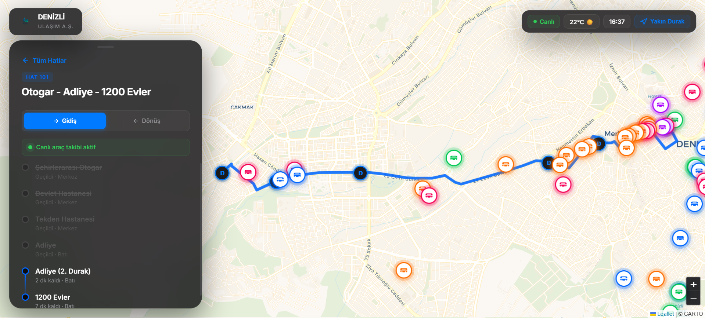

# 🚌 Denizli Akıllı Ulaşım A.Ş. — Akıllı Şehir Transit Sistemi




**Denizli Akıllı Ulaşım**, Denizli şehri için özel olarak tasarlanmış, kurumsal düzeyde bir gerçek zamanlı otobüs takip ve simülasyon sistemidir. Modern **Glassmorphism** estetiği ve **OSRM** tabanlı gerçek yol rotalarıyla donatılan bu uygulama, kullanıcılara üst düzey bir şehir içi ulaşım deneyimi sunar.

---

## 🌟 Öne Çıkan Özellikler

- **🛣️ Gerçek Yol Geometrisi:** Otobüsler artık kuş uçuşu değil, **OSRM (Open Source Routing Machine)** verileriyle gerçek sokaklar ve caddeler üzerinden ilerler.
- **🕒 Canlı Senkronizasyon:** Tüm otobüsler gerçek saate göre hareket eder. Uygulamayı açtığınız anda her araç, o anki gerçek konumundan yolculuğuna başlar.
- **🚌 Geniş Şehir Ağı:** 80'den fazla aktif hat ve aynı anda haritada süzülen 160'tan fazla canlı otobüs.
- **📍 Hassas Durak Verileri:** Otogar, PAÜ, Pamukkale ve Karahayıt gibi 38 kritik nokta, gerçek GPS koordinatlarıyla sisteme entegre edilmiştir.
- **💎 Premium Karanlık Arayüz:** Apple tarzı ikonlar, şeffaf cam paneller (Glassmorphism) ve akıcı geçiş animasyonları.
- **🌓 Dinamik Splash Screen:** Kurumsal logolu, animasyonlu ve şehirle özdeşleşen yeşil temalı özel açılış ekranı.

---

## 📸 Uygulama Galerisi

<div align="center">

| 🚀 Açılış Ekranı | 🗺️ Canlı Harita | 📋 Hat Detayları |
| :---: | :---: | :---: |
|  |  |  |

</div>

---

## 🛠️ Kullanılan Teknolojiler

- **Frontend:** HTML5, CSS3 (Modern Vanilla CSS), JavaScript (ES6+)
- **Harita Motoru:** [Leaflet.js](https://leafletjs.com/)
- **Yönlendirme:** Leaflet Routing Machine & OSRM API
- **Tasarım:** Glassmorphism, CSS Grid/Flexbox, Keyframe Animations
- **Veri Yapısı:** JSON tabanlı dinamik `stops.js` ve `routes.js` mimarisi

---

## 🚀 Kurulum ve Çalıştırma

Projeyi yerel makinenizde çalıştırmak oldukça basittir. Herhangi bir derleme süreci gerektirmez.

1.  **Depoyu Klonlayın:**
    ```bash
    git clone https://github.com/Quadraxx/denizli-otobus.git
    ```
2.  **Dizine Girin:**
    ```bash
    cd denizli-otobus
    ```
3.  **Çalıştırın:**
    `index.html` dosyasını favori tarayıcınızda açmanız yeterlidir.

---

## 📁 Dosya Yapısı

- 📄 `index.html`: Uygulamanın ana iskeleti ve açılış (splash) ekranı.
- 🎨 `style.css`: Premium karanlık tema ve cam efektli (glassmorphism) stiller.
- ⚙️ `app.js`: Simülasyon motoru, saat senkronizasyonu ve harita mantığı.
- 📍 `stops.js`: Denizli'deki tüm durakların GPS veritabanı.
- 🛤️ `routes.js`: 80+ hattın durak dizilimleri ve renk tanımları.
- 🖼️ `logo.png`: Kurumsal logo görseli.

---

## 📜 Lisans

Bu proje **MIT Lisansı** kapsamında sunulmaktadır. Özgürce kullanabilir ve geliştirebilirsiniz.

---

### 👨‍💻 Geliştirici Ekibi
**Denizli Akıllı Şehir Teknolojileri** tarafından geliştirilmiştir. ✨

> *"Şehrin ulaşımı artık parmaklarınızın ucunda."*
